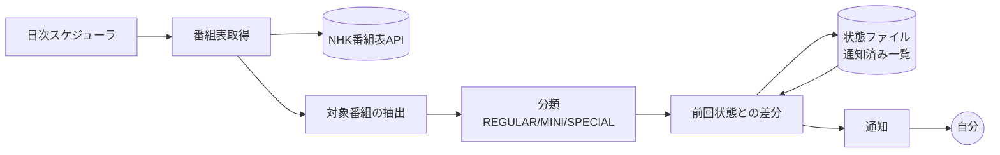

# pythagora-notifications コンセプト資料

> ピタゴラスイッチの放送予定、とくに **不定期の特番** を取りこぼさずに通知するツール。
> 本書は実装に入る前の設計の土台（自分用）。決定事項と未決事項を分けて記載する。

- ステータス: ドラフト（v0.2）
- 最終更新: 2026-09-22
- v0.2 の変更: NHK番組表APIの仕様を調査し §7 を全面改訂。調査結果を受けて §8.3（状態管理）・§10・§11・§12 を修正

---

## 1. 背景と課題

ピタゴラスイッチは Eテレのレギュラー枠で放送されているが、それとは別に **不定期の特番**（放送尺が長い特別編）が挟まる。レギュラー枠は録画予約を「毎週」で仕込んでおけば取り逃さないのに対し、特番は次の理由で取りこぼしやすい。

1. **予告がない / 気づけない** — 放送日が決まるのは直前で、能動的に番組表を見に行かない限り気づけない。
2. **枠が違う** — 曜日・時刻・放送尺がレギュラーと異なるため、既存の「毎週予約」に引っかからない。
3. **タイトルが揺れる** — 「ピタゴラスイッチ」「ピタゴラスイッチ ミニ」「ピタゴラスイッチ 特別編〜」など表記が一定でなく、タイトル完全一致のキーワード予約では拾えたり拾えなかったりする。
4. **気づいた時には放送後** — 録画は事前にしか仕掛けられないため、事後に気づいても手遅れ。

つまり課題は「番組表を毎日見張る」という**人間がやると続かない作業**であり、これは自動化に向いている。

### 解きたいこと（一文）

**「ピタゴラスイッチの特番が番組表に現れた瞬間に気づき、録画予約を仕掛ける余裕があるうちに自分に知らせる」**

---

## 2. ゴール / 非ゴール

### ゴール

| # | ゴール | 満たせたと言える条件 |
|---|--------|----------------------|
| G1 | 特番の見逃しをゼロにする | 番組表に出た特番が、放送前に必ず1回は手元に通知されている |
| G2 | 気づくのが早い | 番組表に出現してから通知まで24時間以内 |
| G3 | 通知がうるさくない | 同じ放送回について重複通知しない。レギュラー回は既定で通知しない |
| G4 | 運用の手間がゼロ | 一度動かしたら、サーバー管理・手動実行なしで動き続ける |
| G5 | 録画予約に繋がる | 通知を見てから予約操作に移れる情報（日時・チャンネル・尺・番組名）が揃っている |

### 非ゴール（やらないこと）

- **録画そのものの自動化** — レコーダー操作・自動録画予約は対象外。あくまで「人間に知らせる」までで止める。
- **見逃し配信の代替** — NHKプラス等への誘導や視聴機能は持たない。
- **他番組への一般化（当面）** — 設計上は汎用化できる形にしておくが、v1 はピタゴラスイッチ専用で良い。
- **多人数向けサービス化** — 自分用ツール。認証・マルチユーザー・課金は考えない。
- **過去放送のアーカイブ / データベース化** — 通知に必要な範囲の履歴だけ持つ。

---

## 3. 想定ユーザーとユースケース

**ユーザー = 自分ひとり**（ピタゴラスイッチの特番を録画したい視聴者）。

| UC | シナリオ | 期待する振る舞い |
|----|----------|------------------|
| UC1 | 特番が番組表に載った | 「◯月◯日 ◯時〜、60分、特番らしい」と通知が届く |
| UC2 | 放送日が近づいた | 予約忘れ防止のリマインドが前日または当日朝に届く |
| UC3 | 放送日時が変更された | 「前は◯日◯時だったが◯日◯時に変わった」と差分が通知される |
| UC4 | 番組が消えた（休止・差し替え） | 「予定されていた放送が番組表から消えた」と通知される |
| UC5 | レギュラー回しかない週 | **何も通知が来ない**（静かなのが正常） |

UC5 が地味に重要。「何も起きない時に何も言わない」ことが、通知を信用できるかどうかを決める。

---

## 4. コンセプト

> **番組表の見張り番。**
> 毎日1回 NHK の番組表を取りに行き、「前回見たときと違うもの」「レギュラー枠から外れたもの」だけを拾って通知する。

設計上の中心思想は3つ。

1. **差分がすべて** — 番組表の全件ではなく「前回との差分」を通知単位とする。だから毎日動かしても静かでいられる。
2. **分類は保守的に** — 特番かどうか判定に迷ったら「特番かもしれない」として通知する。**見逃し（偽陰性）のコストは、余計な通知（偽陽性）のコストよりずっと高い**。
3. **状態は小さく持つ** — 通知済みかどうかを覚えるだけ。DBを立てない。

---

## 5. スコープ

### MVP（v1）— これが動けば課題は解ける

- [ ] NHK番組表APIから Eテレの番組リストを日次で取得（取得可能な先の日付まで）
- [ ] 「ピタゴラスイッチ」関連番組の抽出
- [ ] レギュラー回 / ミニ / 特番候補 の分類
- [ ] 通知済み管理（重複通知の抑制）
- [ ] 特番候補を1チャネルに通知（UC1）
- [ ] 定期実行（クラウド上で毎日自動）

### v1.1 以降の候補

- [ ] 放送日前日のリマインド（UC2）
- [ ] 日時変更・消滅の差分通知（UC3, UC4）
- [ ] カレンダー（ics / Google カレンダー）への登録 — **録画忘れ防止には通知よりカレンダーの方が効く可能性がある**
- [ ] 対象番組を設定ファイルで追加できるようにする（汎用化）
- [ ] BS・総合など他チャンネルへの拡大
- [ ] 通知文面に番組内容（あらすじ）を含める

---

## 6. ドメインモデル

### 6.1 番組の分類

取得した番組を次のいずれかに分類する。分類ロジックが本ツールの中核。

| 区分 | 定義（案） | 通知するか |
|------|------------|-----------|
| `REGULAR` | レギュラー枠（既定の曜日・時刻・放送尺と一致） | しない |
| `MINI` | 「ミニ」表記の短尺版 | しない |
| `SPECIAL` | 上記のいずれにも当てはまらない = **特番候補** | **する** |
| `UNKNOWN` | 判定に必要な情報が欠けている | する（安全側に倒す） |

### 6.2 特番判定のシグナル

単一の条件ではなく、複数シグナルの組み合わせで判断する。

1. **放送尺** — レギュラー枠と異なる尺（特に長尺）は特番の強いシグナル。
2. **枠（曜日・時刻）** — 既知のレギュラー枠から外れた放送。
3. **タイトル** — 「特別編」「スペシャル」「大会」等の語を含む。ただし**タイトルだけに依存しない**（表記揺れで落ちるため）。
4. **サブタイトル / 番組説明** — 補助的に使う。

> 判定の優先度: **尺と枠 > タイトル文字列**。タイトルは揺れるが、尺と枠は物理的にズレるため信頼できる。

### 6.3 通知イベント

```
NotificationEvent
  ├─ NEW_SPECIAL        新しい特番候補を検出した
  ├─ SCHEDULE_CHANGED   既知の放送の日時・尺が変わった
  ├─ CANCELLED          既知の放送が番組表から消えた
  └─ REMINDER           放送が近づいた（前日 / 当日朝）
```

---

## 7. データソース

| 候補 | 内容 | 評価 |
|------|------|------|
| **NHK番組表API**（`api-portal.nhk.or.jp`） | NHK公式の番組表API。APIキーを取得して利用 | **第一候補。** 公式・構造化データ・規約が明確 |
| NHK番組表サイトのスクレイピング | HTMLを解析 | 非推奨。利用規約・HTML構造変化の両面でリスク |
| 民間の番組表サービス | 各社の番組表 | 規約・安定性の面でAPIに劣る。フォールバック候補 |

### 7.1 調査でわかったこと（重要）

#### ⚠️ 現行は v3。ネット上の情報はほぼ全部 v2 以前で、そのまま使えない

NHK番組表APIにはバージョンの変遷がある。

| 版 | 時期 | 取得可能期間 | 備考 |
|----|------|--------------|------|
| v1 | 2014年提供開始 | 当日から**2日先（最大48時間）**まで | 初期仕様 |
| v2 | 2016年6月〜 | 当日から**1週間先**まで | `api.nhk.or.jp/v2/pg/...` 形式 |
| **v3** | **1月13日提供開始（現行）** | （下記 7.2 参照） | v2は**2月12日で提供終了** |

> 移行の「年」は二次情報から確定できなかった（本書作成時点で現行が v3 であることは確か）。ポータルで確認する。

**v3 は v2 とは別物と考えた方がよいレベルで変わっている。** 判明している主な違い:

- **テレビとラジオでエンドポイントが分離された**
- レスポンスJSONの構造が変更されており、v2向けのコードはそのままでは動かない（v3のJSONをv2形式に変換するプロキシを自作している人がいるほどの差異）

この事実が実装方針に直結する。

> **Web上のブログ記事・Qiita記事・各言語のクライアントライブラリ（Python/Perl/Scala 等）は、確認した限りすべて v2 以前を前提にしている。**
> サンプルコードをコピーして動かす進め方は成立しない。**一次情報は公式ポータルのドキュメントのみ**とし、実装は自前で書く。

#### 7.2 確認できた仕様

| 項目 | 内容 | 確度 |
|------|------|------|
| 提供元 / 登録 | `https://api-portal.nhk.or.jp/` で新規登録 → アプリ登録申請 → APIキー発行 | 確 |
| 料金 | 無料 | 確 |
| APIの種類（v2時点） | Program List / Program Genre / Program Info / Now On Air の4種 | 確（v3での構成は要確認） |
| 取得可能期間 | **当日から1週間先まで** | 確（v3でも維持されているかは要確認） |
| リクエスト上限 | **v2 では 300回/日**。v3の上限は未確認 | v2は確 / v3は**要確認** |
| 認証 | APIキーをリクエストに付与 | 確 |
| 日付形式 | `YYYY-MM-DD` | 確 |

**サービスID（v2時点の値。v3で変更がないか要確認）**

| ID | 放送波 |
|----|--------|
| `g1` / `g2` | NHK総合1 / 総合2 |
| **`e1`** | **NHK Eテレ1 ← 本ツールの対象** |
| `e2` / `e3` / `e4` | Eテレ2 / Eテレ3 / ワンセグ2 |
| `s1` / `s3` | NHK BS1 / BSプレミアム |
| `r1` / `r2` / `r3` | ラジオ第1 / 第2 / FM |
| `tv` | テレビ全て（一括） |

**地域ID（area）**: 東京 = `130`、大阪 = `270`。全国分の一覧は公式ポータルに掲載。

#### 7.3 利用規約上の制約（設計に直接影響する）

- **取得した番組情報を「ダウンロードして保持」することはできない**（キャッシュ等は除く）。ユーザーの番組視聴記録として保存することは認められている、という整理。
- **非商用利用**の範囲で利用する。

> この制約は §8.3 の状態管理の設計を変える。**番組表データそのものを永続化してはいけない。**
> 自分用の非商用ツールであり、保存するのも「自分が通知を受け取った記録」なので趣旨には反しないと考えられるが、**設計としては番組データを溜め込まない形にしておく**のが安全（§8.3 で反映済み）。
> なお上記は v2 時点の規約記述に基づく。**v3 の規約本文は実装前に必ず自分で読むこと。**

### 7.4 設計への含意

1. **1週間先までしか取れない → 日次ポーリングが必須。** 一撃で全部取る設計は成立しない。「取得可能期間に上限がある」という性質は v1〜v3 を通じて一貫しており、このツールの形を決める制約。
2. **逆に1週間の余裕はある。** ゴール G2（24時間以内に通知）と成功指標「放送3日以上前に通知」は、日次実行なら**達成可能**。1週間先の番組表に特番が載った時点で検知できる。
3. **300回/日（v2基準）は十分すぎる。** Eテレ1チャンネル × 8日分 = 1日9リクエスト程度。上限の3%。
4. **取得層は必ず分離する。** v2→v3 の断絶が実際に起きた以上、次のバージョン変更も起きると考えるべき。
5. **公式ドキュメントを読むのが最初の作業。** 本節の「要確認」は、ポータルにログインすれば全部その場で解決する。

### 7.5 この調査で確認できなかったこと

以下は公式ポータル（`api-portal.nhk.or.jp`）がログイン前提かつ今回の調査環境から到達できなかったため未確認。**実装着手時に自分でポータルを開いて確認する。**

- v3 のエンドポイントURL形式
- v3 のレスポンスJSONのフィールド名（特に**番組の一意IDがあるか** — §8.3 の設計に影響）
- v3 のリクエスト上限
- v3 で取得可能期間が1週間のまま維持されているか
- v3 の利用規約本文
- v3 にジャンル検索・キーワード検索に相当する機能があるか

## 8. システム構成

### 8.1 推奨案: 定期実行 + ファイル状態管理



最小の構成要素は4つだけ。

1. **スケジューラ** — 毎日決まった時刻に起動する
2. **取得・分類** — APIを叩いて対象を拾い、分類する
3. **状態** — 「もう通知した放送回」を覚えておく小さな永続データ
4. **通知** — 手元に届ける

### 8.2 実行基盤の比較

| 案 | 内容 | 長所 | 短所 |
|----|------|------|------|
| **A. GitHub Actions のスケジュール実行** | cron で日次ジョブ、状態はリポジトリ内のJSONにコミット | サーバー不要・無料枠・シークレット管理あり・実行ログが残る | 状態更新がコミットになる／スケジュール実行に遅延や停止の可能性 |
| B. サーバーレス（Cloudflare Workers + KV 等） | Cron Trigger + KVに状態保存 | 状態管理が素直・低コスト | 基盤の学習と設定が必要 |
| C. 自宅マシンの cron | ローカル実行 | 完全に自由 | **マシンが落ちていたら見張りが止まる**（ゴールG4に反する） |

> **推奨: A（GitHub Actions）。** 「録画忘れ防止」のために新しく管理対象のサーバーを増やすのは本末転倒で、自分で面倒を見なくていいことが最優先。ただし GitHub Actions のスケジュール実行は**遅延・スキップが起こりうる**ため、「1日欠けても致命的にならない」設計（＝通知済み管理で重複を許容し、複数日にわたって検知チャンスがある）にしておく。

### 8.3 状態ファイルの構造（案）

> **§7.3 の利用規約（取得データをダウンロード保持しない）を踏まえ、番組表データそのものは永続化しない方針に変更した。**
> 保持するのは「自分がどの放送回について通知を受け取ったか」の記録だけ。タイトルや番組内容は通知を送ったら捨てる。

```json
{
  "version": 2,
  "last_run_at": "2026-09-22T03:00:00Z",
  "notified": [
    {
      "key": "<番組の一意キー>",
      "broadcast_at": "2026-10-03T09:00:00+09:00",
      "events": { "NEW_SPECIAL": "2026-09-22T03:00:10Z", "REMINDER": null }
    }
  ]
}
```

保持するのは **キー / 放送日時 / どの通知を送ったか** のみ。タイトル・番組説明・出演者などは持たない。
放送日時を持つのはリマインド（UC2）と期限切れエントリの掃除に要るため。**放送日を過ぎたエントリは削除する**ので、ファイルは自然に小さいまま保たれる。

**一意キーの選び方が重要。** v3のレスポンスに安定した番組IDが含まれるならそれを使う（§7.5 の要確認事項）。含まれない／不安定な場合は `サービス + 開始日時` から導出する。ただし後者は**日時変更で別番組に見えてしまう**ため、UC3（変更検知）を実装する段階では「タイトル＋近い日付」でのマッチングが要る。

> タイトルを保持しない方針とUC3（変更検知）は弱く衝突する。変更検知を実装するなら、タイトルそのものではなく**タイトルのハッシュ値**を持てば、データを保持せずに「変わったかどうか」だけ判定できる。

## 9. 通知設計

### 9.1 チャネル選定

| 候補 | 評価 |
|------|------|
| **Discord / Slack の Webhook** | **第一候補。** URL1本で送れて実装が最小。スマホ通知も届く |
| メール（SMTP等） | 確実に届くが埋もれやすい |
| プッシュ通知サービス（ntfy, Pushover 等） | スマホ通知に特化していて良い。依存先が増える |
| LINE | かつての LINE Notify は終了しているため、代替手段の可否を要確認 |
| **カレンダー登録（ics / Google カレンダー）** | **通知と併用したい。** 録画忘れ防止の本質は「予約操作をする時点で目に入ること」であり、カレンダーの方が通知より効く可能性が高い |

> 設計としては **通知チャネルを差し替え可能なインターフェースにしておく**（`Notifier` 相当の抽象）。v1 は Webhook 1本、後から追加。

### 9.2 通知タイミング

| イベント | タイミング | 理由 |
|----------|-----------|------|
| NEW_SPECIAL | 検出したらすぐ | 早いほど予約の余裕がある |
| REMINDER | 放送前日 | 予約を忘れていた場合の最後の砦 |
| SCHEDULE_CHANGED / CANCELLED | 検出したらすぐ | 予約の修正が要るため |

### 9.3 通知文面（案）

```
📺 ピタゴラスイッチの特番かもしれません

  ピタゴラスイッチ 特別編 ピタゴラ装置大会
  10月3日(土) 9:00 - 10:00 (60分)
  Eテレ

  ※ レギュラー枠(15分)と尺が違うため特番と判定
```

文面の要件:
- **録画予約に必要な情報が全部入っている**（日時・尺・チャンネル・番組名）→ 通知を見たまま予約操作に移れる
- **なぜ特番と判定したかを書く** → 誤検知だった時に人間がすぐ切り捨てられる
- 断定しない（「特番かもしれません」）→ 判定を保守的に倒している以上、文面も正直にする

---

## 10. 技術選定（案）

| 領域 | 選択 | 理由 |
|------|------|------|
| 言語 | TypeScript / Python のいずれか | どちらでも成立する。日付処理とHTTPしかしないため、書き慣れた方でよい |
| APIクライアント | **自前実装**（既存ライブラリは使わない） | 公開されているクライアントライブラリは確認した限りすべて v2 以前対応で、現行 v3 では動かない（§7.1） |
| 実行 | GitHub Actions (schedule) | §8.2 |
| 状態 | リポジトリ内 JSON | DB不要。ただし**番組データは持たない**（§7.3, §8.3） |
| 設定 | 環境変数（APIキー・Webhook URL）+ 設定ファイル（レギュラー枠の定義） | シークレットとロジックの分離 |
| テスト | 番組表レスポンスの固定データに対する分類ロジックのユニットテスト | **分類ロジックが本体なので、ここだけは必ずテストする** |

### タイムゾーンの扱い

**放送時刻は JST で考える。** 日付境界のズレは「1日分の番組表を取り逃す」に直結するため、
- APIとのやり取り・内部保持・表示で、どの時点で JST/UTC を扱うかを明示的に決める
- 深夜番組（24時台以降の表記）の扱いを確認する

は実装初期に潰しておく。

---

## 11. リスクと対策

| # | リスク | 影響 | 対策 |
|---|--------|------|------|
| R1 | **特番を見逃す（偽陰性）** | ツールの存在意義が消える | 判定を保守的に。迷ったら通知。分類ロジックにテストを書く |
| R2 | **API のバージョン変更**（v2→v3 で実際に発生済み） | 動作停止。ある日から何も通知が来なくなる | データ取得層を分離。**R3の死活監視と併せて、壊れたことに気づける状態を保つのが実質的な対策** |
| R3 | **静かに壊れる**（実行が止まっているのに気づかない） | R1と同じ結果になる | **通知が来ないことと壊れていることを区別できる仕組み**が要る（§12） |
| R4 | API のリクエスト上限超過 | 取得失敗 | 1日1回の実行に抑える。実行回数を把握しておく |
| R5 | 誤検知が多すぎる | 通知を信用しなくなる | 判定理由を通知文面に書く。レギュラー枠の定義を設定で直せるようにする |
| R6 | レギュラー枠自体が改編で変わる | 全件が特番判定になる | 枠の定義を設定ファイルに外出しし、手で直せるようにする |
| R7 | 利用規約に反したデータ保持 | 規約違反 | 番組表データを永続化しない設計にする（§8.3）。v3の規約本文を実装前に読む |

### R3 が一番怖い

このツールは**正常時に何も出力しない**。つまり「通知が来ない」が正常とも異常とも取れる。

そして R2 は**仮定ではなく実績**である。v2 は2月12日に提供終了しており、当時 v2 を叩いていたツールは全部その日に黙って死んだはずだ。**R2 が起きたときに R3 の仕組みがないと、特番を録り逃して初めて気づく**ことになる。この2つはセットで対策する。対策の方向性:

- 週に1度、「今週も見張っています／特番はありませんでした」というハートビート通知を出す
- 実行失敗時にエラー通知を出す（GitHub Actions の失敗通知でも代用可）

---

## 12. 未決事項 / 要調査

### 解決済み（v0.2 の調査で判明）

- [x] NHK番組表APIの取得可能期間 → **当日から1週間先まで**（§7.2）
- [x] リクエスト上限 → **v2で300回/日**。本ツールの想定使用量は1日10回未満で余裕あり（§7.4）
- [x] APIキーの取得方法 → ポータルで登録 → アプリ登録申請（§7.2）
- [x] 対象チャンネルの指定方法 → service=`e1`（Eテレ1）、area=`130`（東京）（§7.2）
- [x] 利用規約上のデータ保持制限の存在 → **あり。設計に反映済み**（§7.3, §8.3）
- [x] **現行バージョンは v3。v2は提供終了済み**（§7.1）← 最大の発見

### 未解決（公式ポータルにログインすれば即解決するもの）

**実装の最初の作業として、`https://api-portal.nhk.or.jp/` にログインして以下をまとめて確認する。**

- [ ] **v3 のエンドポイントURL形式**（テレビ/ラジオ分離後の形）
- [ ] **v3 のレスポンスに番組の一意IDがあるか** ← §8.3 のキー設計が決まる
- [ ] v3 のリクエスト上限
- [ ] v3 でも取得可能期間が1週間のままか
- [ ] v3 の利用規約本文（データ保持・非商用の条件）
- [ ] v3 のレスポンスに放送尺（または終了時刻）が含まれるか ← **特番判定の主シグナルなので必須**

### 未解決（API仕様とは別に必要な調査）

- [ ] **レギュラー枠の実態** — 現在の放送曜日・時刻・尺（本編 / ミニ）。分類の基準になる
- [ ] **過去の特番の実例** — 実際の特番が番組表上でどう表記され、尺がどうだったかのサンプル収集。**分類ロジックのテストケースの元になるので、これが一番価値が高い調査**
- [ ] 深夜番組の日付境界の扱い
- [ ] 通知チャネルの最終決定（Discord / ntfy / カレンダー）
- [ ] 再放送をどう扱うか（通知する？初回のみ？）
- [ ] BS・総合など他チャンネルでも放送されることがあるか

## 13. ロードマップ

| フェーズ | 内容 | 完了条件 |
|----------|------|----------|
| **P0: 調査** | ポータルにログインして v3 仕様を確認（§12）。APIキーを取得し、**v3を手で叩いて実データを見る** | v3のEテレ番組表レスポンスのサンプルが手元にあり、番組IDと放送尺の有無が判明している |
| **P1: 分類ロジック** | 取得済みサンプルに対して REGULAR/MINI/SPECIAL を分類 | 過去の特番サンプルを正しく SPECIAL と判定できる（テスト付き） |
| **P2: 通知** | 検出結果を1チャネルへ送る | 手元に通知が届く |
| **P3: 自動化** | 定期実行 + 状態管理 + 重複抑制 | 数日間放置しても重複通知が来ない |
| **P4: 実戦投入** | 運用開始 | **実際の特番を1回、事前に検知できた** |
| P5: 改善 | リマインド・変更検知・カレンダー連携 | — |

P1 を P2 より先に置いているのは、**このプロジェクトの難所が通知ではなく分類だから**。通知は Webhook を叩くだけで終わるが、分類を外すと何を作っても意味がない。

---

## 14. 成功指標

| 指標 | 目標 |
|------|------|
| 特番の検知率 | **100%**（1件でも見逃したら設計を見直す） |
| 検知から通知までの時間 | 24時間以内 |
| 放送何日前に通知できたか | 3日以上前が望ましい |
| 誤検知の通知数 | 月1件以下（0でなくてよい。見逃すよりマシ） |
| 手動介入の回数 | ゼロ（改編期を除く） |

**最終的な成功条件は数字ではなく、「特番を録り逃した」という出来事が起きなくなること。**

---

## 付録A: 命名について

`pythagora-notifications` — ピタゴラスイッチ（Pythagora Switch）の通知ツール。
将来的に対象番組を設定で追加できる形に育てる場合も、この名前のままで支障はない。

---

## 付録B: 調査記録（2026-09-22）

本書 v0.2 の §7 は以下の情報を元にしている。**いずれも二次情報であり、公式ドキュメントでの裏取りが前提**（§7.5）。
調査時点で公式ポータル `api-portal.nhk.or.jp` には調査環境から到達できなかった。

- [NHK番組表API ポータル（一次情報 / 要ログイン）](https://api-portal.nhk.or.jp/)
- [NHK、番組表APIを無償提供。番組情報を活用したアプリやサイトを制作可能に - AV Watch](https://av.watch.impress.co.jp/docs/news/602497.html) — 提供開始時の仕様、利用規約上のデータ保持制限
- [NHKが番組表APIを無償提供開始へ - ASCII.jp](https://ascii.jp/elem/000/000/796/796460/) — 初期仕様（当日から48時間先まで）
- [NHK番組表APIの紹介 - idealive tech blog](https://idealive.jp/blog/2019/01/16/nhk番組表apiの紹介/) — 4種のAPI構成、v2で1週間先まで拡張
- [その2370。NHK番組bot、NHK番組表APIのv3対応を完了 - 北海道のアンジュルムファンのブログ](https://ameblo.jp/hokkaidosm/entry-12953809290.html) — **v2提供終了とv3移行、v3でテレビ/ラジオのエンドポイントが分離**
- [NHK番組表 #番組リスト: 検索 - Questetra Support](https://support.questetra.com/ja/addons/nhk-program-guide-programs-search/) — サービスID一覧
- [第531話：テレビ番組表の自動検索 - ワークフローサンプル](https://ja.workflow-sample.net/2017/04/nhk-api.html) — エンドポイント形式、300回/日の上限
- [v3tov2proxy - GitHub](https://github.com/hellodevelopersworld/v3tov2proxy) — v3のJSONをv2形式へ変換するプロキシ。v3とv2の差異の大きさを示す例
