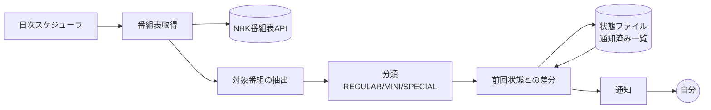

# pythagora-notifications コンセプト資料

> ピタゴラスイッチの放送予定、とくに **不定期の特番** を取りこぼさずに通知するツール。
> 本書は実装に入る前の設計の土台（自分用）。決定事項と未決事項を分けて記載する。

- ステータス: ドラフト（v0.1）
- 最終更新: 2026-09-22

---

## 1. 背景と課題

ピタゴラスイッチは Eテレのレギュラー枠で放送されているが、それとは別に **不定期の特番**（放送尺が長い特別編）が挟まる。レギュラー枠は録画予約を「毎週」で仕込んでおけば取り逃さないのに対し、特番は次の理由で取りこぼしやすい。

1. **予告がない / 気づけない** — 放送日が決まるのは直前で、能動的に番組表を見に行かない限り気づけない。
2. **枠が違う** — 曜日・時刻・放送尺がレギュラーと異なるため、既存の「毎週予約」に引っかからない。
3. **タイトルが揺れる** — 「ピタゴラスイッチ」「ピタゴラスイッチ ミニ」「ピタゴラスイッチ 特別編〜」など表記が一定でなく、タイトル完全一致のキーワード予約では拾えたり拾えなかったりする。
4. **気づいた時には放送後** — 録画は事前にしか仕掛けられないため、事後に気づいても手遅れ。

つまり課題は「番組表を毎日見張る」という**人間がやると続かない作業**であり、これは自動化に向いている。

### 解きたいこと（一文）

**「ピタゴラスイッチの特番が番組表に現れた瞬間に気づき、録画予約を仕掛ける余裕があるうちに自分に知らせる」**

---

## 2. ゴール / 非ゴール

### ゴール

| # | ゴール | 満たせたと言える条件 |
|---|--------|----------------------|
| G1 | 特番の見逃しをゼロにする | 番組表に出た特番が、放送前に必ず1回は手元に通知されている |
| G2 | 気づくのが早い | 番組表に出現してから通知まで24時間以内 |
| G3 | 通知がうるさくない | 同じ放送回について重複通知しない。レギュラー回は既定で通知しない |
| G4 | 運用の手間がゼロ | 一度動かしたら、サーバー管理・手動実行なしで動き続ける |
| G5 | 録画予約に繋がる | 通知を見てから予約操作に移れる情報（日時・チャンネル・尺・番組名）が揃っている |

### 非ゴール（やらないこと）

- **録画そのものの自動化** — レコーダー操作・自動録画予約は対象外。あくまで「人間に知らせる」までで止める。
- **見逃し配信の代替** — NHKプラス等への誘導や視聴機能は持たない。
- **他番組への一般化（当面）** — 設計上は汎用化できる形にしておくが、v1 はピタゴラスイッチ専用で良い。
- **多人数向けサービス化** — 自分用ツール。認証・マルチユーザー・課金は考えない。
- **過去放送のアーカイブ / データベース化** — 通知に必要な範囲の履歴だけ持つ。

---

## 3. 想定ユーザーとユースケース

**ユーザー = 自分ひとり**（ピタゴラスイッチの特番を録画したい視聴者）。

| UC | シナリオ | 期待する振る舞い |
|----|----------|------------------|
| UC1 | 特番が番組表に載った | 「◯月◯日 ◯時〜、60分、特番らしい」と通知が届く |
| UC2 | 放送日が近づいた | 予約忘れ防止のリマインドが前日または当日朝に届く |
| UC3 | 放送日時が変更された | 「前は◯日◯時だったが◯日◯時に変わった」と差分が通知される |
| UC4 | 番組が消えた（休止・差し替え） | 「予定されていた放送が番組表から消えた」と通知される |
| UC5 | レギュラー回しかない週 | **何も通知が来ない**（静かなのが正常） |

UC5 が地味に重要。「何も起きない時に何も言わない」ことが、通知を信用できるかどうかを決める。

---

## 4. コンセプト

> **番組表の見張り番。**
> 毎日1回 NHK の番組表を取りに行き、「前回見たときと違うもの」「レギュラー枠から外れたもの」だけを拾って通知する。

設計上の中心思想は3つ。

1. **差分がすべて** — 番組表の全件ではなく「前回との差分」を通知単位とする。だから毎日動かしても静かでいられる。
2. **分類は保守的に** — 特番かどうか判定に迷ったら「特番かもしれない」として通知する。**見逃し（偽陰性）のコストは、余計な通知（偽陽性）のコストよりずっと高い**。
3. **状態は小さく持つ** — 通知済みかどうかを覚えるだけ。DBを立てない。

---

## 5. スコープ

### MVP（v1）— これが動けば課題は解ける

- [ ] NHK番組表APIから Eテレの番組リストを日次で取得（取得可能な先の日付まで）
- [ ] 「ピタゴラスイッチ」関連番組の抽出
- [ ] レギュラー回 / ミニ / 特番候補 の分類
- [ ] 通知済み管理（重複通知の抑制）
- [ ] 特番候補を1チャネルに通知（UC1）
- [ ] 定期実行（クラウド上で毎日自動）

### v1.1 以降の候補

- [ ] 放送日前日のリマインド（UC2）
- [ ] 日時変更・消滅の差分通知（UC3, UC4）
- [ ] カレンダー（ics / Google カレンダー）への登録 — **録画忘れ防止には通知よりカレンダーの方が効く可能性がある**
- [ ] 対象番組を設定ファイルで追加できるようにする（汎用化）
- [ ] BS・総合など他チャンネルへの拡大
- [ ] 通知文面に番組内容（あらすじ）を含める

---

## 6. ドメインモデル

### 6.1 番組の分類

取得した番組を次のいずれかに分類する。分類ロジックが本ツールの中核。

| 区分 | 定義（案） | 通知するか |
|------|------------|-----------|
| `REGULAR` | レギュラー枠（既定の曜日・時刻・放送尺と一致） | しない |
| `MINI` | 「ミニ」表記の短尺版 | しない |
| `SPECIAL` | 上記のいずれにも当てはまらない = **特番候補** | **する** |
| `UNKNOWN` | 判定に必要な情報が欠けている | する（安全側に倒す） |

### 6.2 特番判定のシグナル

単一の条件ではなく、複数シグナルの組み合わせで判断する。

1. **放送尺** — レギュラー枠と異なる尺（特に長尺）は特番の強いシグナル。
2. **枠（曜日・時刻）** — 既知のレギュラー枠から外れた放送。
3. **タイトル** — 「特別編」「スペシャル」「大会」等の語を含む。ただし**タイトルだけに依存しない**（表記揺れで落ちるため）。
4. **サブタイトル / 番組説明** — 補助的に使う。

> 判定の優先度: **尺と枠 > タイトル文字列**。タイトルは揺れるが、尺と枠は物理的にズレるため信頼できる。

### 6.3 通知イベント

```
NotificationEvent
  ├─ NEW_SPECIAL        新しい特番候補を検出した
  ├─ SCHEDULE_CHANGED   既知の放送の日時・尺が変わった
  ├─ CANCELLED          既知の放送が番組表から消えた
  └─ REMINDER           放送が近づいた（前日 / 当日朝）
```

---

## 7. データソース

| 候補 | 内容 | 評価 |
|------|------|------|
| **NHK番組表API**（`api.nhk.or.jp`） | NHK公式の番組表API。APIキーを取得して利用。放送局・エリア・日付を指定して番組リストを取得できる | **第一候補。** 公式・構造化データ・規約が明確 |
| NHK番組表サイトのスクレイピング | HTMLを解析 | 非推奨。利用規約・HTML構造変化の両面でリスク |
| 民間の番組表サービス | 各社の番組表 | 規約・安定性の面でAPIに劣る。フォールバック候補 |

### NHK番組表API を使ううえでの制約（要確認事項）

| 項目 | 現時点の理解 | 設計への影響 |
|------|--------------|--------------|
| 取得できる期間 | **未来1週間程度まで**（それより先は取れない） | → **一撃で全部取れない。日次ポーリングが必須** |
| リクエスト上限 | 1日あたりの回数上限がある | → 1日1回の実行で十分収まる設計にする |
| APIキー | 無料の開発者登録が必要 | → シークレット管理が必要 |
| 対象の指定 | エリアID + サービスID（Eテレ）+ 日付 | → 対象を正しく特定する必要あり |

> ⚠️ 上記は**実装前に公式ドキュメントで必ず裏取りする**。特に「取得できる期間」と「リクエスト上限」はアーキテクチャを決める数字なので、憶測で進めない。

**「1週間先までしか取れない」という制約が、このツールの形をほぼ決めている。** 一度きりの取得では足りず、毎日見張り続ける常駐的な仕組みが要る。逆に言えば、1日1回動けば十分で、リアルタイム性は要らない。

---

## 8. システム構成

### 8.1 推奨案: 定期実行 + ファイル状態管理



最小の構成要素は4つだけ。

1. **スケジューラ** — 毎日決まった時刻に起動する
2. **取得・分類** — APIを叩いて対象を拾い、分類する
3. **状態** — 「もう通知した放送回」を覚えておく小さな永続データ
4. **通知** — 手元に届ける

### 8.2 実行基盤の比較

| 案 | 内容 | 長所 | 短所 |
|----|------|------|------|
| **A. GitHub Actions のスケジュール実行** | cron で日次ジョブ、状態はリポジトリ内のJSONにコミット | サーバー不要・無料枠・シークレット管理あり・実行ログが残る | 状態更新がコミットになる／スケジュール実行に遅延や停止の可能性 |
| B. サーバーレス（Cloudflare Workers + KV 等） | Cron Trigger + KVに状態保存 | 状態管理が素直・低コスト | 基盤の学習と設定が必要 |
| C. 自宅マシンの cron | ローカル実行 | 完全に自由 | **マシンが落ちていたら見張りが止まる**（ゴールG4に反する） |

> **推奨: A（GitHub Actions）。** 「録画忘れ防止」のために新しく管理対象のサーバーを増やすのは本末転倒で、自分で面倒を見なくていいことが最優先。ただし GitHub Actions のスケジュール実行は**遅延・スキップが起こりうる**ため、「1日欠けても致命的にならない」設計（＝通知済み管理で重複を許容し、複数日にわたって検知チャンスがある）にしておく。

### 8.3 状態ファイルの構造（案）

```json
{
  "version": 1,
  "last_run_at": "2026-09-22T03:00:00Z",
  "known_programs": {
    "<番組の一意キー>": {
      "title": "ピタゴラスイッチ 特別編",
      "start_at": "2026-10-03T09:00:00+09:00",
      "end_at": "2026-10-03T10:00:00+09:00",
      "duration_min": 60,
      "service": "Eテレ",
      "classification": "SPECIAL",
      "notified": {
        "NEW_SPECIAL": "2026-09-22T03:00:10Z",
        "REMINDER": null
      }
    }
  }
}
```

**一意キーの選び方が重要。** APIが番組ごとに安定したIDを返すならそれを使う。返さない／不安定な場合は `サービス + 開始日時` から導出する。ただし後者は**日時変更で別番組に見えてしまう**ため、UC3（変更検知）を実装する段階では「タイトル＋近い日付」でのマッチングが要る。

---

## 9. 通知設計

### 9.1 チャネル選定

| 候補 | 評価 |
|------|------|
| **Discord / Slack の Webhook** | **第一候補。** URL1本で送れて実装が最小。スマホ通知も届く |
| メール（SMTP等） | 確実に届くが埋もれやすい |
| プッシュ通知サービス（ntfy, Pushover 等） | スマホ通知に特化していて良い。依存先が増える |
| LINE | かつての LINE Notify は終了しているため、代替手段の可否を要確認 |
| **カレンダー登録（ics / Google カレンダー）** | **通知と併用したい。** 録画忘れ防止の本質は「予約操作をする時点で目に入ること」であり、カレンダーの方が通知より効く可能性が高い |

> 設計としては **通知チャネルを差し替え可能なインターフェースにしておく**（`Notifier` 相当の抽象）。v1 は Webhook 1本、後から追加。

### 9.2 通知タイミング

| イベント | タイミング | 理由 |
|----------|-----------|------|
| NEW_SPECIAL | 検出したらすぐ | 早いほど予約の余裕がある |
| REMINDER | 放送前日 | 予約を忘れていた場合の最後の砦 |
| SCHEDULE_CHANGED / CANCELLED | 検出したらすぐ | 予約の修正が要るため |

### 9.3 通知文面（案）

```
📺 ピタゴラスイッチの特番かもしれません

  ピタゴラスイッチ 特別編 ピタゴラ装置大会
  10月3日(土) 9:00 - 10:00 (60分)
  Eテレ

  ※ レギュラー枠(15分)と尺が違うため特番と判定
```

文面の要件:
- **録画予約に必要な情報が全部入っている**（日時・尺・チャンネル・番組名）→ 通知を見たまま予約操作に移れる
- **なぜ特番と判定したかを書く** → 誤検知だった時に人間がすぐ切り捨てられる
- 断定しない（「特番かもしれません」）→ 判定を保守的に倒している以上、文面も正直にする

---

## 10. 技術選定（案）

| 領域 | 選択 | 理由 |
|------|------|------|
| 言語 | TypeScript / Python のいずれか | どちらでも成立する。日付処理とHTTPしかしないため、書き慣れた方でよい |
| 実行 | GitHub Actions (schedule) | §8.2 |
| 状態 | リポジトリ内 JSON | DB不要。差分がコミット履歴に残るのは副次的なメリット |
| 設定 | 環境変数（APIキー・Webhook URL）+ 設定ファイル（レギュラー枠の定義） | シークレットとロジックの分離 |
| テスト | 番組表レスポンスの固定データに対する分類ロジックのユニットテスト | **分類ロジックが本体なので、ここだけは必ずテストする** |

### タイムゾーンの扱い

**放送時刻は JST で考える。** 日付境界のズレは「1日分の番組表を取り逃す」に直結するため、
- APIとのやり取り・内部保持・表示で、どの時点で JST/UTC を扱うかを明示的に決める
- 深夜番組（24時台以降の表記）の扱いを確認する

は実装初期に潰しておく。

---

## 11. リスクと対策

| # | リスク | 影響 | 対策 |
|---|--------|------|------|
| R1 | **特番を見逃す（偽陰性）** | ツールの存在意義が消える | 判定を保守的に。迷ったら通知。分類ロジックにテストを書く |
| R2 | API の仕様変更・提供終了 | 動作停止 | データ取得層を分離し、差し替え可能にしておく |
| R3 | **静かに壊れる**（実行が止まっているのに気づかない） | R1と同じ結果になる | **通知が来ないことと壊れていることを区別できる仕組み**が要る（§12） |
| R4 | API のリクエスト上限超過 | 取得失敗 | 1日1回の実行に抑える。実行回数を把握しておく |
| R5 | 誤検知が多すぎる | 通知を信用しなくなる | 判定理由を通知文面に書く。レギュラー枠の定義を設定で直せるようにする |
| R6 | レギュラー枠自体が改編で変わる | 全件が特番判定になる | 枠の定義を設定ファイルに外出しし、手で直せるようにする |

### R3 が一番怖い

このツールは**正常時に何も出力しない**。つまり「通知が来ない」が正常とも異常とも取れる。対策の方向性:

- 週に1度、「今週も見張っています／特番はありませんでした」というハートビート通知を出す
- 実行失敗時にエラー通知を出す（GitHub Actions の失敗通知でも代用可）

---

## 12. 未決事項 / 要調査

実装に入る前に潰すべき項目。上ほど優先度が高い。

- [ ] **NHK番組表API の正確な仕様** — 取得可能期間、リクエスト上限、番組の一意ID の有無、エリア/サービスIDの指定方法、利用規約
- [ ] **レギュラー枠の実態** — 現在の放送曜日・時刻・尺（本編 / ミニ）。ここが分類の基準になる
- [ ] **過去の特番の実例** — 実際の特番が番組表上でどう表記され、尺がどうだったかのサンプル収集。**分類ロジックのテストケースの元になるので、これが一番価値が高い調査**
- [ ] 深夜番組の日付境界の扱い
- [ ] 通知チャネルの最終決定（Discord / ntfy / カレンダー）
- [ ] 再放送をどう扱うか（通知する？初回のみ？）
- [ ] BS・総合など他チャンネルでも放送されることがあるか

---

## 13. ロードマップ

| フェーズ | 内容 | 完了条件 |
|----------|------|----------|
| **P0: 調査** | §12 の上位3項目を潰す。APIを手で叩いて実データを見る | 実際の番組表レスポンスのサンプルが手元にある |
| **P1: 分類ロジック** | 取得済みサンプルに対して REGULAR/MINI/SPECIAL を分類 | 過去の特番サンプルを正しく SPECIAL と判定できる（テスト付き） |
| **P2: 通知** | 検出結果を1チャネルへ送る | 手元に通知が届く |
| **P3: 自動化** | 定期実行 + 状態管理 + 重複抑制 | 数日間放置しても重複通知が来ない |
| **P4: 実戦投入** | 運用開始 | **実際の特番を1回、事前に検知できた** |
| P5: 改善 | リマインド・変更検知・カレンダー連携 | — |

P1 を P2 より先に置いているのは、**このプロジェクトの難所が通知ではなく分類だから**。通知は Webhook を叩くだけで終わるが、分類を外すと何を作っても意味がない。

---

## 14. 成功指標

| 指標 | 目標 |
|------|------|
| 特番の検知率 | **100%**（1件でも見逃したら設計を見直す） |
| 検知から通知までの時間 | 24時間以内 |
| 放送何日前に通知できたか | 3日以上前が望ましい |
| 誤検知の通知数 | 月1件以下（0でなくてよい。見逃すよりマシ） |
| 手動介入の回数 | ゼロ（改編期を除く） |

**最終的な成功条件は数字ではなく、「特番を録り逃した」という出来事が起きなくなること。**

---

## 付録: 命名について

`pythagora-notifications` — ピタゴラスイッチ（Pythagora Switch）の通知ツール。
将来的に対象番組を設定で追加できる形に育てる場合も、この名前のままで支障はない。
